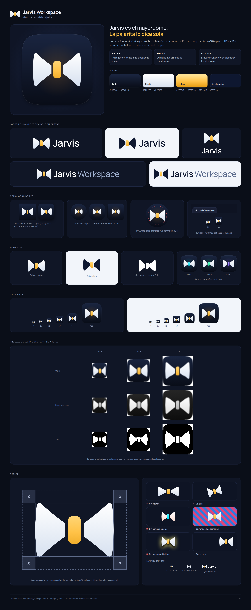

# Jarvis Workspace — brand kit



The mark is a **bow tie**. Jarvis is the butler of your agents:

- **The wings** are your agents, one on each side, working at the same time.
- **The knot** is what ties them together — the coordination point.
- The knot is also a **block cursor**: it reads "terminal" before anyone has to explain it.

It is deliberately *not* a letter, a sparkle, an orb or a cyan HUD ring: AI-tool logos converged on
those, and a symbol that looks like everyone else's is not a symbol. Three solid shapes, no hairlines,
no gradients that carry meaning: it reads the same in colour, in greys and in 1-bit
(see the legibility tests on the brand sheet).

> Status: **not wired into the app yet.** These are the assets; nothing in `frontend/` or `plotspace/`
> references them. See [Wiring it in](#wiring-it-in).

## Colours

| Name | Hex | Use |
| --- | --- | --- |
| Ink | `#1A2540` → `#090D18` | icon tile (top → bottom) |
| Ivory | `#FFFFFF` → `#D7E1F0` | wings on dark |
| Brass | `#FFE59A` · `#FFC247` · `#E39A10` | the knot (the only accent) |
| Midnight | `#0E1730` | wings on light surfaces |

One accent over neutrals, in a hue the AI-coding category does not use (amber). The knot is the only
coloured element, so the mark survives any recolour: `alternativas/` carries the same icon (SVG) in
cyan, mint and violet, and `python3 brand/build_brand.py --accent cian` rebuilds the whole kit with it.

## Type

The wordmark is **Manrope SemiBold** (SIL Open Font License, see `fonts/OFL-Manrope.txt`), converted to
curves with real kerning — the SVGs contain no text and need no font. "Workspace" is Manrope Regular.

## What is in the box

```
brand/
├─ svg/                         vector masters
│  ├─ jarvis-mark.svg           mark on dark (ivory wings + brass knot)
│  ├─ jarvis-mark-onlight.svg   mark on light (midnight wings)
│  ├─ jarvis-mark-mono.svg      one colour, fill="currentColor" (the gap keeps the knot readable)
│  ├─ jarvis-lockup*.svg        mark + "Jarvis"      (-onlight, -mono, -stacked)
│  ├─ jarvis-workspace-lockup*.svg   mark + "Jarvis Workspace"
│  └─ jarvis-icon*.svg          app tile (squircle / on light / full-bleed square)
├─ app/
│  ├─ web/        favicon.svg · favicon.ico (16/32/48) · apple-touch-icon.png (180, opaque)
│  │              icon-192.png · icon-512.png · icon-maskable-512.png · icon-monochrome-512.png
│  │              site.webmanifest
│  ├─ ios/        icon-1024.png        1024, full-bleed, no alpha, no baked light (the system masks it)
│  ├─ apple/icon-composer/             flat layers for Icon Composer (macOS/iOS 26+)
│  ├─ macos/      icon-1024.png · jarvis.icns   classic style: 824 px body + 100 px margin + shadow
│  ├─ windows/    jarvis.ico           16 24 32 48 64 128 256, one raster per size
│  ├─ linux/      hicolor/{16…512}x…/apps/jarvis-workspace.png + scalable SVG
│  ├─ android/    adaptive: ic_launcher_{background,foreground,monochrome}.svg (108 dp) · play-store-512.png
│  └─ tray/       jarvisTemplate.png (+@2x) · jarvis-tray-64.png     black + alpha
├─ social/        social-preview-1280x640.png (GitHub / Open Graph)
├─ alternativas/  the icon in other accents, and the concepts that were explored and not chosen
├─ jarvis-brand-sheet.png         the whole identity on one page
├─ build_brand.py · build_sheet.py   generators (see Regenerating)
└─ fonts/         Manrope Regular/SemiBold + licence
```

Small sizes are **not** just a downscale: `build_brand.py` applies an optical size per raster — at 16–32 px
the mark grows (86 % → 72 % of the tile) and the glow and rim are dropped, because the gap and the
gradients are sub-pixel there.

## Using it

**Web.** Copy `app/web/*` to wherever the app serves static files and add:

```html
<link rel="icon" href="/favicon.ico" sizes="32x32">
<link rel="icon" href="/icon.svg" type="image/svg+xml">      <!-- app/web/favicon.svg -->
<link rel="apple-touch-icon" href="/apple-touch-icon.png">
<link rel="manifest" href="/site.webmanifest">
<meta name="theme-color" content="#090D18">
```

`site.webmanifest` already lists the `any`, `maskable` and `monochrome` icons. The maskable icon keeps
the mark inside the 80 % safe circle (checked by `plotspace/tests/test_brand_assets.py`).

**macOS.** `app/macos/jarvis.icns` is the classic (≤ 15) look. For macOS 26+ build the icon in
Icon Composer from `app/apple/icon-composer/`: `background.svg` as the fill, `wings.svg` and `knot.svg` as
two flat foreground layers (do not bake shadows or highlights: the system adds its own).

**iOS / iPadOS.** `app/ios/icon-1024.png` — 1024², opaque, square. Do not round the corners.

**Windows / Linux.** `app/windows/jarvis.ico`; `app/linux/hicolor/` is a ready-made icon theme tree
(`jarvis-workspace` icon name).

**Android.** Import the three adaptive layers (108 dp; the mark sits inside the 66 dp safe zone) and
use `play-store-512.png` for the store listing.

**Tray / menu bar.** `app/tray/jarvisTemplate.png` is a macOS template image (black + alpha); use the
SVG mono mark for other trays.

## Rules

- **Clear space:** the width of the knot (`x`) on every side. **Minimum size:** 16 px as an icon, 24 px wide
  as the bare mark, 96 px wide as the logotype.
- On light surfaces use `jarvis-mark-onlight.svg`; on a single-colour print or UI use `-mono`.
- Do not stretch, rotate, recolour, add shadows or glows, crop it, or put it on a busy background.
- In UI code never hard-code the hex values: the project rule is `var(--ob-*)`. The mono SVG uses
  `currentColor` for exactly that reason.

## Regenerating

```bash
pip install -r brand/requirements.txt       # skia-pathops, fonttools, uharfbuzz, playwright (+ Pillow)
python3 brand/build_brand.py                # SVG + PNG + ICO + ICNS   (--svg-only skips Chromium)
python3 brand/build_sheet.py                # jarvis-brand-sheet.png
```

The geometry lives in `GEOM` at the top of `build_brand.py` (wing span, curve, knot size, gap). Output is
deterministic. If Playwright cannot find its browser, point `CHROMIUM_PATH` at any Chromium binary.

## Wiring it in

Not done on purpose — it is a visible product change. When you want it: copy `app/web/*` into `frontend/`
(everything under it is served at `/static`), add the `<link>` tags above to `index.html`,
`shell/workspace.html` and `editor-standalone.html` (bump their `?v=`), and, if the app should answer
`/favicon.ico` at the root, add a FastAPI route for it.

## Background

- Apple — [App icons](https://developer.apple.com/design/human-interface-guidelines/app-icons) ·
  [Icon Composer](https://developer.apple.com/documentation/xcode/creating-your-app-icon-using-icon-composer)
- Android — [Adaptive icons](https://developer.android.com/develop/ui/views/launch/icon_design_adaptive)
- W3C — [Web App Manifest](https://www.w3.org/TR/appmanifest/) (maskable safe zone)
- Windows — [App icon construction](https://learn.microsoft.com/en-us/windows/apps/design/iconography/app-icon-construction)
- Why not a sparkle — [Google Design](https://design.google/library/ai-sparkle-icon-research-pozos-schmidt) ·
  [Nielsen Norman Group](https://www.nngroup.com/articles/ai-sparkles-icon-problem)
